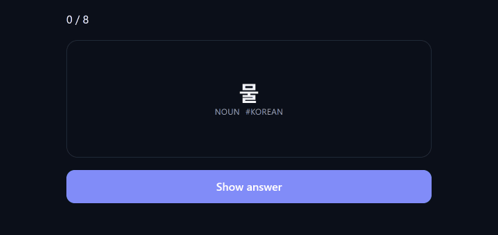

<!--
  The demo GIF is generated from the real playground, not hand-made:
  `pnpm docs` in one terminal, then `node scripts/record-demo.mjs`.
  Re-record it whenever the study UI changes.

  Once the docs site is deployed, wrap the image in a link to it and add a
  "Try the live demo" entry to the nav row below.
-->

<h1 align="center">Recall</h1>

<p align="center">
  <strong>Spaced repetition you don't have to build again.</strong>
</p>

<p align="center">
  FSRS and SM-2, headless React components, and pluggable storage —<br />
  drop a real study app into your product in an afternoon.
</p>

<p align="center">
  <a href="https://www.npmjs.com/package/@recall-srs/core"></a>
  <a href="https://github.com/Sthabiso10/recall-srs/actions/workflows/ci.yml"></a>
  <!--
    Static rather than a bundlephobia badge: that service rate-limits and
    renders "rate limited by upstream service" into the SVG often enough to be
    embarrassing. This number comes from `pnpm size` and CI fails if it grows
    past budget, so it cannot drift far. Update it if the budget changes.
  -->
  <a href="#size"></a>
  
  
  
</p>

<p align="center">
  
</p>

<p align="center">
  <a href="#quick-start"><strong>Quick start</strong></a>
  &nbsp;·&nbsp;
  <a href="#run-the-playground">Run the playground</a>
  &nbsp;·&nbsp;
  <a href="#why-fsrs">Why FSRS</a>
  &nbsp;·&nbsp;
  <a href="#storage">Storage</a>
</p>

> [!WARNING]
> **Pre-1.0 and moving.** The API will change before 1.0 — `0.2.0` changed scheduling
> behaviour and renamed a prop. Pin an exact version and read the
> [changelog](CHANGELOG.md) before upgrading. SM-2 is not implemented yet and throws if you
> try to construct it; use FSRS.

---

## Quick start

```bash
pnpm add @recall-srs/core @recall-srs/react @recall-srs/adapter-localstorage
```

```tsx
import { createFSRSScheduler } from '@recall-srs/core';
import { SRSProvider, StudyView } from '@recall-srs/react';
import { createLocalStorageAdapter } from '@recall-srs/adapter-localstorage';

const adapter = createLocalStorageAdapter();
const scheduler = createFSRSScheduler({ desiredRetention: 0.9 });

export default function Study() {
  return (
    <SRSProvider adapter={adapter} scheduler={scheduler} deckId="korean-101">
      <StudyView session={{ limit: 20 }} />
    </SRSProvider>
  );
}
```

That's a working flashcard app: card flipping, four grading buttons labelled with their real
intervals, a review queue with daily caps, and persistence. No account, no schema, no backend.

Add some cards and you're done:

```ts
import { createCard } from '@recall-srs/core';

await adapter.saveCards([
  createCard({ question: '물', answer: 'water', tags: ['noun'], deckId: 'korean-101' }),
  createCard({ question: '먹다', answer: 'to eat', tags: ['verb'], deckId: 'korean-101' }),
]);
```

### Run the playground

The GIF above is the real thing, not a mockup. Run it yourself:

```bash
pnpm install
pnpm docs
```

Then open <http://localhost:3000/playground> — an 8-card Korean deck on the localStorage
adapter, with FSRS scheduling and the progress dashboard underneath. Progress is saved in your
browser only.

---

## Why FSRS

Most flashcard libraries ship SM-2, the 1987 SuperMemo algorithm: multiply the interval by an
"ease factor" and hope. Recall ships **FSRS**, which models memory explicitly — stability,
difficulty, retrievability — and is what Anki has used by default since 2023.

Two differences you can feel:

**Retention is a setting, not an outcome.** You choose the target; the scheduler solves for the
interval. SM-2 cannot even express the question.

```ts
createFSRSScheduler({ desiredRetention: 0.95 }); // shorter intervals, more reviews/day
createFSRSScheduler({ desiredRetention: 0.85 }); // longer intervals, fewer reviews/day
```

**Being late is information.** Recalling a card you were *about* to forget proves far more than
recalling one you saw yesterday, and FSRS schedules accordingly. SM-2 throws that away.

You also get recall probability for any card, which SM-2 has no way to compute:

```ts
scheduler.retrievabilityOf(card); // 0–1, right now

// Sort a queue by what's closest to being forgotten.
cards.sort((a, b) => scheduler.retrievabilityOf(a) - scheduler.retrievabilityOf(b));
```

SM-2 is still included via `createScheduler()`. Both implement the same six-method `Scheduler`
interface, so switching is one line and needs **no data migration** — FSRS keeps its state in a
field SM-2 ignores.

### Why not just use ts-fsrs?

Fair question, and if you only need the algorithm you probably should —
[`ts-fsrs`](https://github.com/open-spaced-repetition/ts-fsrs) is the reference TypeScript
implementation, maintained by the FSRS project itself, and it is excellent at exactly that job.

Recall solves a bigger problem. FSRS tells you when a card is next due; it does not tell you
which twenty cards to show today, how to cap new cards, what to do with a card that has lapsed
nine times, where any of it is stored, or what the study screen looks like. That is the part
every team rebuilds, and it is most of the work.

| | `ts-fsrs` | Recall |
| --- | --- | --- |
| FSRS scheduling | ✅ | ✅ |
| Card / deck / review-log model | — | ✅ |
| Review queue, daily caps, ordering | — | ✅ |
| Study session state machine | — | ✅ |
| React components and hooks | — | ✅ |
| Storage adapters | — | ✅ |
| Retention curves, forecasts, streaks | — | ✅ |
| Load balancing, leech handling | — | ✅ |
| Weight optimiser | — | ✅ |
| Maintained by the FSRS project | ✅ | — |

If you already have your own card model and UI, use `ts-fsrs`. If you're building a study app
from scratch, Recall is the larger head start.

### Fitting the algorithm to your learners

The default weights are a population average. FSRS is designed to have them
**optimised per learner** from their own review history — that is the whole argument for it
over SM-2, and it is why review logs are append-only.

```ts
import { optimizeFSRSWeights } from '@recall-srs/core/optimizer';

const result = await optimizeFSRSWeights(await adapter.listReviews());

if (result.recommendation === 'adopt') {
  const scheduler = createFSRSScheduler({ weights: result.weights });
} else {
  console.log(result.reason); // plain language, safe to show a user
}
```

It holds out a fifth of the cards, trains on the rest, and reports whether the fit predicts
the held-out cards better than the weights it started from. On simulated learners who differ
from the population average it recovers roughly 60% of the available gain — a 7% reduction in
prediction error on cards it never saw.

It also refuses to run below ~400 reviews and tells you why. Fitting nineteen parameters to
thin history produces weights that describe the past beautifully and predict the future worse
than the defaults did, so **"keep the defaults" is a successful outcome**, not a failure.

Separate entry point on purpose: a study screen never ships the fitting code.

### Size

Measured by `pnpm size`, minified and brotli-compressed, and enforced in CI:

| | Size |
| --- | --- |
| `@recall-srs/core` (everything) | **5.8 kB** |
| `@recall-srs/core` (scheduler + card model only, tree-shaken) | **2.7 kB** |
| `@recall-srs/react` | **3.6 kB** |
| `@recall-srs/adapter-localstorage` | **1.0 kB** |
| `@recall-srs/core/optimizer` | **2.7 kB**, and only if you import it |

Zero runtime dependencies in the core, so that is the whole cost.

---

## Headless when you want it

The default components are semantic and unstyled, with `data-*` hooks on every element. Style
them with plain CSS, Tailwind, anything.

When you'd rather own the markup, pass a render prop and Recall renders nothing at all:

```tsx
<StudyView>
  {({ card, revealed, reveal, grade, preview, progress }) =>
    !card ? <Done /> : (
      <YourCard progress={progress}>
        <h2>{card.question}</h2>
        {revealed
          ? <YourButtons onRate={grade} hints={preview} /> // "Again · 1d", "Easy · 12d"
          : <button onClick={reveal}>Show answer</button>}
      </YourCard>
    )
  }
</StudyView>
```

Same deal for `<ProgressDashboard>`. Or skip the components entirely and use the hooks:
`useSRS()`, `useStudySession()`, `useProgress()`.

---

## Storage

One `StorageAdapter` interface. Ten async methods. Swap backends in a line:

```ts
const adapter = createLocalStorageAdapter();                 // prototype
const adapter = createSupabaseAdapter({ client: supabase }); // production
```

| Package | Status | Notes |
| --- | --- | --- |
| `@recall-srs/adapter-localstorage` | **Working** | Zero setup. ~5MB per origin, no sync. |
| `@recall-srs/adapter-supabase` | Skeleton | `schema.sql` is complete — tables, indexes, RLS. |
| `@recall-srs/adapter-firebase` | Skeleton | Firestore subcollections per user. |
| `@recall-srs/adapter-convex` | Skeleton | Ships schema + server functions to copy in. |

Writing your own is four rules: every method async, review logs append-only, JSON-safe data in
and out, and throw `StorageError` rather than returning `[]` on failure — a silently empty deck
looks like "you're done!" to a learner. The localStorage adapter is the reference
implementation, ~200 readable lines.

---

## Architecture

```
@recall-srs/adapter-*  ─┐
                        ├─►  @recall-srs/core  ◄─  @recall-srs/react
your own backend       ─┘
```

`core` knows nothing about React, storage or the DOM. It defines two ports — `StorageAdapter`
and `Clock` — and everything plugs into them. That's what makes the engine usable from a CLI, a
Discord bot or React Native, and the scheduling logic testable without a browser.

Three rules the codebase holds to:

1. **Scheduling functions are pure.** `grade(card, 4)` returns a new card and a review log. It
   never mutates its input and never writes to storage.
2. **Review logs are append-only.** Scheduling state is a cache of the latest review; the log is
   the history every analytic derives from — including, eventually, the FSRS weight optimiser.
   Nothing overwrites or deletes it, `deleteCard` included.
3. **The view layer owns no logic.** If you're computing an interval inside a `.tsx` file, it
   belongs in the core.

---

## Status

Honest state of things. FSRS is implemented and tested; a few pieces are deliberately left as
scoped, well-commented work.

**Working**

- FSRS end to end — forgetting curve, stability/difficulty updates, retention targeting
- Scheduler wiring: grading, review logs, due checks, interval previews
- Queue building — filtering, daily caps, four ordering strategies
- Sessions — reveal, grade, skip, requeue lapses, summary
- The localStorage adapter
- React provider, three hooks, four components
- Docs site with a live playground

**Open** — each of these is a good first issue

| Where | What |
| --- | --- |
| `core/src/algorithm/sm2.ts` | `nextEaseFactor`, `nextInterval`, the transition table |
| `core/src/algorithm/fsrs-params.ts` | verify the 19 default weights against the reference impl |
| `core/src/stats/index.ts` | `computeRetentionCurve`, `streakDays` |
| `react/.../RatingButtons.tsx` | keyboard shortcuts (1–4) |
| `adapters/supabase`, `firebase`, `convex` | the queries; schemas are done |
| — | FSRS weight optimiser, fitted from a user's review log |

---

## Development

```bash
pnpm install
pnpm test        # Jest, core
pnpm typecheck   # tsc --noEmit, every package
pnpm docs        # docs site + playground on :3000
pnpm build       # tsup bundles for publishing
```

Strict mode with `noUncheckedIndexedAccess` on — a scheduler that silently mishandles an
undefined interval is worse than one that refuses to compile.

Workspace packages resolve to `src/` during development, and `publishConfig` swaps them to
`dist/` at publish time. So everything works from a clean clone with no build step, library
edits hot-reload in the docs, and published consumers still get the compiled bundle.

## Contributing

Issues and PRs welcome — the table above is a good place to start. Run `pnpm changeset` in any
PR that changes a published package.

## License

MIT

<!--
  Regenerating the demo GIF:

    pnpm docs                        # terminal 1
    node scripts/record-demo.mjs     # terminal 2

  Drives the real playground in Edge, captures each state, and encodes a
  looping GIF. Keep it under ~8 seconds and a few hundred kB — GitHub is
  slow to load anything larger, and nobody watches past the loop anyway.
-->
